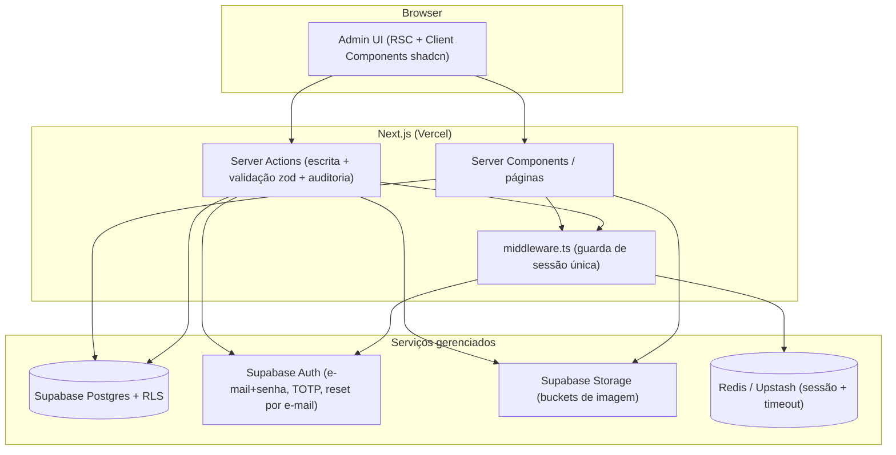
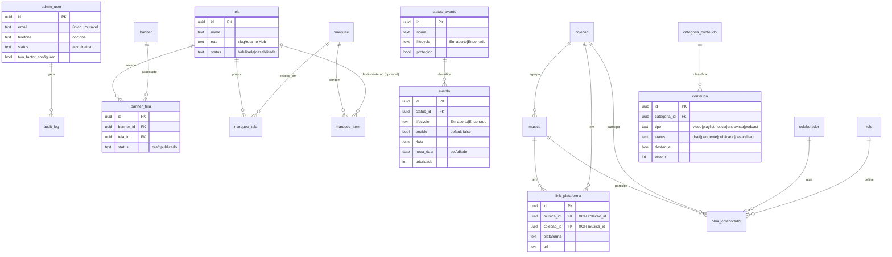

# Arquitetura — Plataforma Administrativa Karmaleões

> **Porta de entrada técnica** do projeto. Este documento descreve a estrutura geral da aplicação, o
> mapa de domínio, os padrões transversais e o índice dos planos de desenvolvimento por módulo.
>
> **Camadas de documentação** (cada uma referencia as outras, sem duplicar):
> - [`VISAO_GERAL.md`](./VISAO_GERAL.md) — visão de produto e fronteira Admin↔Hub.
> - `modules/<MODULO>/*` — **specs funcionais** (RF/RN, FLOWCHART, TESTES). Fonte da verdade do _o quê_.
> - [`docs/superpowers/plans/CONVENTIONS.md`](./docs/superpowers/plans/CONVENTIONS.md) — stack e regras transversais fixadas.
> - [`docs/superpowers/plans/README.md`](./docs/superpowers/plans/README.md) — roadmap macro, sequência e esforço.
> - **Este `ARQUITETURA.md` + [`docs/arquitetura/`](./docs/arquitetura/)** — _como construir_: blueprint técnico e planos de dev por módulo.

---

## 1. Resumo executivo

Plataforma administrativa que configura o **Hub público Karmaleões** (telas, navegação, banners, eventos,
conteúdos digitais e obras musicais) e centraliza a operação de conteúdo num único painel autenticado.

- **Usuários:** operadores administrativos (sem auto-registro; criados internamente). Sem níveis de
  permissão no MVP — todo usuário autenticado e ativo tem acesso integral.
- **Escopo (6 módulos):** Autenticação (1), Telas/Navegação/Marquees (2), Banners (3), Eventos (4),
  Conteúdos Digitais (5), Obras & Colaborações (6). **Fora:** Hub público, Propostas Comerciais e Fãs/CRM.
- **Natureza:** aplicação CRUD com regras de visibilidade por módulo, auditoria de escrita e 2FA obrigatório.

---

## 2. Stack

Fixada em [`CONVENTIONS.md §1`](./docs/superpowers/plans/CONVENTIONS.md). Resumo:

| Camada | Decisão |
|--------|---------|
| Framework | Next.js (App Router, 15+), TypeScript. Mutations via **Server Actions**. |
| Banco/Auth/Storage | **Supabase** — Postgres + Auth (e-mail+senha + **MFA TOTP** nativo) + Storage. |
| Dados | supabase-js (`@supabase/ssr`) + **migrations SQL** via Supabase CLI. Sem ORM. |
| Sessão/cache | **Redis (Upstash)** — sessão única + timeout de inatividade. |
| UI | shadcn/ui + Tailwind; formulários com react-hook-form + **zod**. |
| Testes | **Vitest** (unit/integration) + **Playwright** (e2e) contra Supabase local. |
| Deploy | GitHub Actions (lint/typecheck/test) → **Vercel**. pnpm. |

---

## 3. Visão de arquitetura



- **Leitura:** Server Components consultam o Postgres (via `@supabase/ssr`), respeitando RLS.
- **Escrita:** Server Actions validam com zod, executam a mutação, **registram auditoria** e revalidam.
- **Sessão:** `middleware.ts` valida o cookie do Supabase Auth **e** a sessão única no Redis (ver
  [`transversal-totp-e-sessao.md`](./docs/arquitetura/transversal-totp-e-sessao.md)).
- **Visibilidade no Hub:** cada módulo tem mecanismo próprio (tabela §6). O Hub (fora deste escopo)
  consome os dados publicados; Eventos expõem campos virtuais via **view SQL**.

---

## 4. Mapa de domínio (ERD consolidado)



> Os campos virtuais de evento (`expirado`, `status_efetivo`, `enable_efetivo`) **não** são colunas:
> são calculados na leitura pela view `eventos_view` (ver [`04-eventos.md`](./docs/arquitetura/04-eventos.md)).

---

## 5. Estrutura de pastas (código)

Consolida [`CONVENTIONS.md §2`](./docs/superpowers/plans/CONVENTIONS.md). Regra: arquivos que mudam juntos vivem juntos.

```
app/
  (auth)/                login/  recuperar-senha/  configurar-2fa/
  (admin)/               # rotas protegidas (layout com guarda de sessão)
    usuarios/
    telas/  marquees/
    banners/
    eventos/  eventos/status/
    conteudos/  conteudos/categorias/
    obras/  obras/colaboradores/  obras/roles/
    layout.tsx
  middleware.ts          # valida sessão + sessão única (Redis)
lib/
  supabase/ server.ts client.ts admin.ts
  redis.ts   audit.ts   storage.ts
  validation/            # schemas zod por entidade
components/
  ui/                    # shadcn
  data-table/  form/     # padrões reutilizáveis (lista, form, upload, confirm)
supabase/
  migrations/*.sql       seed.sql
tests/
  unit/  integration/  e2e/
```

---

## 6. Padrões transversais

Detalhe em [`docs/arquitetura/transversal-*.md`](./docs/arquitetura/). Resumo:

| Tema | Documento | Essência |
|------|-----------|----------|
| Banco, RLS, migrations | [`transversal-banco-rls-migrations.md`](./docs/arquitetura/transversal-banco-rls-migrations.md) | snake_case, uuid, timestamps/trigger; RLS único (autenticado+ativo → CRUD); view de eventos |
| TOTP & sessão | [`transversal-totp-e-sessao.md`](./docs/arquitetura/transversal-totp-e-sessao.md) | enroll/challenge TOTP nativo; sessão única + timeout no Redis; middleware |
| Auditoria | [`transversal-auditoria.md`](./docs/arquitetura/transversal-auditoria.md) | `audit_log` + helper em toda Server Action de escrita (módulos 1–6) |
| Storage de imagens | [`transversal-storage-imagens.md`](./docs/arquitetura/transversal-storage-imagens.md) | buckets por domínio; upload via `lib/storage.ts`; path/URL na entidade |

**Visibilidade no Hub por módulo:**

| Módulo | Mecanismo | Oculto quando |
|--------|-----------|---------------|
| Telas (2) | status habilitada/desabilitada | desabilitada |
| Banners (3) | status da associação Banner×Tela | draft ou tela desabilitada |
| Eventos (4) | `enable_efetivo` (campo virtual) | enable false ou expirado |
| Conteúdos (5) | status editorial | ≠ publicado |
| Obras (6) | — | sempre visível após cadastro |

**Links externos** sempre abrem em **nova aba** (`target="_blank" rel="noopener noreferrer"`).

---

## 7. Ambientes & deploy

- **Local:** `supabase start` (Postgres/Auth/Storage local) + Upstash (ou Redis local) + `pnpm dev`.
- **CI:** GitHub Actions — lint, typecheck, Vitest, Playwright (contra Supabase local).
- **Produção:** Vercel (app) + Supabase cloud (banco/auth/storage) + Upstash (Redis) + e-mail
  transacional nativo do Supabase Auth (reset de senha / TOTP).
- **Migrations** versionadas em `supabase/migrations/`; nunca editar migration aplicada — criar nova.

---

## 8. Riscos técnicos & decisões abertas

| Tipo | Item | Tratamento |
|------|------|-----------|
| Risco | **Sessão única em Redis** é o principal custom (resto do auth é nativo Supabase) | Isolar em `lib/redis.ts` + `middleware.ts`; cobrir por integração/e2e |
| Risco | **Expiração de eventos por view** — cálculo consistente em toda leitura | Centralizar na view `eventos_view`; unit test do cálculo; nunca recalcular na app |
| Risco | RLS sem RBAC — política única ampla | Política "autenticado + ativo"; revisar se RBAC entrar em escopo futuro |
| Lacuna | Data corrente / fuso usado na expiração | A definir pelo dev (documentar na view) |
| Lacuna | Timeout de inatividade da sessão | A definir pelo dev (TTL do Redis) |
| Lacuna | Formatos/limites de upload de imagem | A definir pelo dev (validar em `lib/storage.ts`) |
| Lacuna | Reset/regeneração de 2FA por admin | Fora do MVP; registrar como evolução |

---

## 9. Índice dos planos de desenvolvimento

**Cadência: sequencial** — `00 → 01 → 02 → 03 → 04 → 05 → 06` (02→03 é a única subcadeia rígida).

| # | Documento | Módulo / tema |
|---|-----------|---------------|
| 00 | [`00-fundacao-e-infra.md`](./docs/arquitetura/00-fundacao-e-infra.md) | Fundação, scaffold, infra, padrões reutilizáveis |
| 01 | [`01-autenticacao-e-sessao.md`](./docs/arquitetura/01-autenticacao-e-sessao.md) | Autenticação, usuários (Módulo 1) |
| 02 | [`02-telas-navegacao-e-marquees.md`](./docs/arquitetura/02-telas-navegacao-e-marquees.md) | Telas, navegação, marquees (Módulo 2) |
| 03 | [`03-banners-por-tela.md`](./docs/arquitetura/03-banners-por-tela.md) | Banners por tela (Módulo 3) |
| 04 | [`04-eventos.md`](./docs/arquitetura/04-eventos.md) | Eventos (Módulo 4) |
| 05 | [`05-conteudos-digitais.md`](./docs/arquitetura/05-conteudos-digitais.md) | Conteúdos digitais (Módulo 5) |
| 06 | [`06-obras-e-colaboracoes.md`](./docs/arquitetura/06-obras-e-colaboracoes.md) | Obras & colaborações (Módulo 6) |
| — | [`transversal-totp-e-sessao.md`](./docs/arquitetura/transversal-totp-e-sessao.md) | TOTP, sessão única, timeout |
| — | [`transversal-auditoria.md`](./docs/arquitetura/transversal-auditoria.md) | Auditoria de escrita |
| — | [`transversal-storage-imagens.md`](./docs/arquitetura/transversal-storage-imagens.md) | Upload/Storage de imagens |
| — | [`transversal-banco-rls-migrations.md`](./docs/arquitetura/transversal-banco-rls-migrations.md) | Banco, RLS, migrations |
