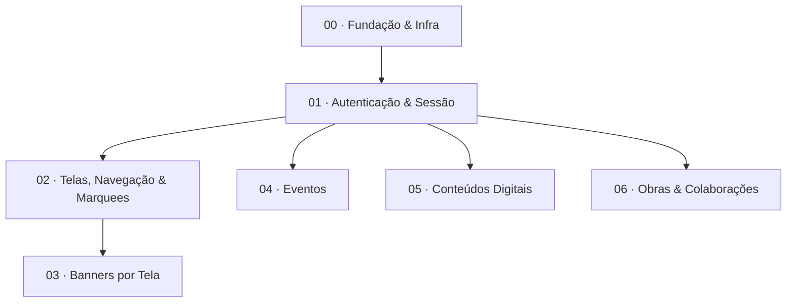

# Roadmap de Implementação — Portal Admin Karmaleões

> **Status:** roadmap macro (engatilhado). Os planos TDD detalhados de cada subsistema serão
> gerados sob demanda, expandindo cada outline abaixo via skill `superpowers:writing-plans`.

**Escopo:** apenas o Admin. Stack e padrões transversais: **[CONVENTIONS.md](./CONVENTIONS.md)**.
**Specs-fonte:** [design consolidado](../specs/2026-05-25-karmaleoes-admin-design.md) · [orçamento](../specs/2026-05-31-orcamento-admin.md) · `modules/*`.

---

## Sequência e dependências

| # | Plano | Depende de | Esforço base (h)¹ | Entrega testável |
|---|-------|------------|------------------:|------------------|
| 00 | Fundação & Infra | — | 72 (fundação) + 40 (infra) | App sobe, shell autenticável (stub), CI verde, Storage e auditoria prontos |
| 01 | Autenticação & Sessão | 00 | 43 | Login e-mail+TOTP, recuperação por e-mail, sessão única, CRUD usuários |
| 02 | Telas, Navegação & Marquees | 01 | 44 | CRUD telas + marquees + itens |
| 03 | Banners por Tela | 02 | 36 | Banner asset + publicação por tela |
| 04 | Eventos | 01 | 62 | CRUD + status dinâmicos + expiração virtual |
| 05 | Conteúdos Digitais | 01 | 38 | CRUD conteúdo + categorias + status editorial |
| 06 | Obras & Colaborações | 01 | 58 | Músicas/coleções/colaboradores/roles/links |

¹ Esforço de **dev** por módulo (do orçamento); testes/design/infra somam nos tracks. Após o plano 01, os planos 02–06 podem ser paralelizados (02→03 é a única cadeia).

---

## Plano 00 — Fundação & Infra

**Goal:** repositório executável com shell admin protegido, clients, padrões reutilizáveis, CI e infra provisionada.
**Specs:** transversais ([CONVENTIONS.md](./CONVENTIONS.md), VISAO_GERAL §Padrões).
**Tabelas:** `audit_log`; helpers `set_updated_at`; políticas RLS base.

**Outline de tarefas:**
- Scaffold Next.js (App Router, TS) + pnpm + ESLint/Prettier + Tailwind + shadcn init.
- Supabase local (`supabase init`/`start`); clients `lib/supabase/{server,client,admin}.ts` (`@supabase/ssr`).
- Redis (Upstash) client `lib/redis.ts` + helpers de sessão (set/get/invalidate, TTL).
- Migration base: extensão `pgcrypto`, função `set_updated_at`, tabela `audit_log` + RLS; `lib/audit.ts`.
- `lib/storage.ts` (upload Supabase Storage) + buckets `banners/conteudos/obras`.
- Shell admin: `app/(admin)/layout.tsx` (nav lateral), `middleware.ts` (guarda de sessão — stub até plano 01).
- Padrões reutilizáveis: `components/data-table` (lista+filtro+paginação), `components/form` (campos+zod+submit), `ImageUpload`, `ConfirmDialog`, toasts.
- Harness de testes: Vitest config + Playwright config + helpers de Supabase local; smoke e2e.
- GitHub Actions (lint, typecheck, vitest, playwright); ambientes Vercel + env (`.env.example`).

**DoD:** app sobe local; `pnpm lint/typecheck/test` verdes; CI passa; `audit()` e `ImageUpload` cobertos por teste.

---

## Plano 01 — Autenticação & Controle de Sessão (Módulo 1)

**Goal:** autenticação e-mail+senha+TOTP, recuperação **por e-mail**, sessão única, timeout e CRUD de usuários, com auditoria.
**Specs:** `modules/AUTENTICACAO_LOGIN_CONTROLE_SESSAO/*` (RF-LOGIN-001..007, RN-LOGIN-001..007).
**Tabelas:** `admin_user` (id, email único/imutável, telefone **opcional**, status ativo/inativo, two_factor_configured, timestamps) — integrado ao Supabase Auth; `seed.sql` 1º admin.

**Outline de tarefas:**
- Migration `admin_user` + RLS + vínculo com `auth.users`; seed do 1º admin (RN-LOGIN-006).
- Login e-mail+senha (Supabase Auth) → challenge **MFA TOTP** (RF-LOGIN-001/002).
- 1º acesso: senha temporária → enroll TOTP (QR) → validação do 1º código (RF-LOGIN-007).
- Sessão única via Redis: grava sessão atual, invalida anterior; `middleware.ts` valida (RF-LOGIN-004/RN-003).
- Timeout de inatividade: TTL renovável (RN-LOGIN-005).
- Recuperação **por e-mail** (Supabase Auth nativo: reset/magic link) → nova senha (RF-LOGIN-003). Sem SMS.
- CRUD de usuários: cadastrar (email+senha temp, telefone opcional), editar telefone, ativar/desativar (RF-LOGIN-005); e-mail imutável/único; inativo não loga (RN-004).
- Auditoria em todas as escritas; acesso integral sem perfis (RN-LOGIN-002).
- E2E do `TESTES.md` (TC-LOGIN-001..025).

**Riscos:** sessão única (Redis) é o principal custom. Recuperação e 2FA usam recursos nativos do Supabase Auth (e-mail + TOTP), sem dependências externas de SMS.

---

## Plano 02 — Telas, Navegação & Marquees (Módulo 2)

**Goal:** CRUD de telas (referências de rota), marquees reutilizáveis (N:N) e itens com navegação interna/externa.
**Specs:** `modules/GESTAO_TELAS_NAVEGACAO_E_MARQUEES/*` (RF-NAV-001..011, RN-NAV-001..007).
**Tabelas:** `tela` (nome, slug/rota, status habilitada/desabilitada); `marquee` (nome, props visuais); `marquee_tela` (N:N); `marquee_item` (titulo, imagem/icone, tipo_nav `interno|externo`, destino, ordem).

**Outline de tarefas:**
- Migrations das 4 tabelas + RLS.
- CRUD telas + habilitar/desabilitar (RF-NAV-001..004).
- CRUD marquees + associação N:N a telas + reutilização (RF-NAV-005/006/007).
- CRUD/ordenação de itens; um destino por item; navegação interna só p/ tela habilitada (RF-NAV-008..011, RN-004/005).
- Links externos: `target="_blank"` (RF-NAV-010).
- Auditoria nas escritas; E2E do `TESTES.md`.

---

## Plano 03 — Banners por Tela (Módulo 3)

**Goal:** banner como asset reutilizável + publicação por associação Banner×Tela (1 publicado por tela, auto-revert).
**Specs:** `modules/GESTAO_BANNERS_POR_TELA/*` (RF-BANNER-001..006, RN-BANNER-001..008).
**Tabelas:** `banner` (nome interno, imagem); `banner_tela` (banner_id, tela_id, status `draft|publicado`, timestamps).

**Outline de tarefas:**
- Migrations + RLS; bucket `banners`.
- CRUD banner (nome+imagem via `ImageUpload`); edição reflete em todas as associações (RF-001/003).
- Associação a telas **habilitadas**, criada em `draft` (RF-002, RN-008).
- Publicação por tela + **máquina de troca**: publicar em tela com ativo → anterior da mesma tela vira `draft`; outras telas inalteradas (RF-004/005, RN-002/006) — **unit test** dedicado.
- Não exibir em tela desabilitada (RN-007); listagem com status por tela (RF-006).
- Auditoria; E2E do `TESTES.md`.

---

## Plano 04 — Eventos (Módulo 4)

**Goal:** CRUD de eventos, status dinâmicos por lifecycle (protegidos), encerramento com regras de data, e **expiração por campos virtuais (sem job)**.
**Specs:** `modules/GESTAO_EVENTOS/*` (RF-EVENTO-001..009, RN-EVENTO-001..015).
**Tabelas:** `status_evento` (nome, lifecycle `Em aberto|Encerrado`, protegido); `evento` (campos + lifecycle, status_id, enable, prioridade, nova_data, obs_encerramento); **view `eventos_view`** (expirado, status_efetivo, enable_efetivo).

**Outline de tarefas:**
- Migrations + seed de status (sem "Expirado"); **view `eventos_view`** (CONVENTIONS §3) — **unit test** do cálculo.
- CRUD evento; enable default false; prioridade (RF-001/002/003/008/009).
- Alteração de status dentro do lifecycle; Adiado exige `nova_data` (RF-004, RN-008).
- CRUD de status; "Adiado" protegido; "Expirado" reservado/não-cadastrável; status em uso não excluível (RF-004b, RN-009/013).
- Encerramento manual: Sucesso só na data de referência+, Cancelado a qualquer hora; obs obrigatória; não altera enable (RF-006, RN-007/011/014/015).
- Leitura via `eventos_view` (status_efetivo/enable_efetivo); link compra em nova aba (RF-007).
- Auditoria; E2E do `TESTES.md` (incl. TC-EVENTO-006g — expiração reativa).

---

## Plano 05 — Conteúdos Digitais (Módulo 5)

**Goal:** CRUD de conteúdos externos com categorias gerenciáveis, status editorial, destaque e ordenação.
**Specs:** `modules/GESTAO_CONTEUDOS_DIGITAIS/*` (RF-CONT-001..009, RN-CONT-001..008).
**Tabelas:** `categoria_conteudo` (nome); `conteudo` (titulo, descricao, thumbnail, categoria_id, tipo enum, plataforma, link, status `draft|pendente|publicado|desabilitado`, destaque, ordem, data).

**Outline de tarefas:**
- Migrations + RLS; bucket `conteudos`.
- CRUD categorias (RF-008).
- CRUD conteúdo (tipo enum fixo; categoria FK); thumbnail via `ImageUpload` (RF-001/002/003).
- Status editorial + destaque + ordenação manual (RF-005/006/009).
- Link externo em nova aba (RF-007); independente de Obras (RN-008).
- Auditoria; E2E do `TESTES.md`.

---

## Plano 06 — Obras & Colaborações (Módulo 6)

**Goal:** músicas, coleções (N:1), colaboradores, roles dinâmicos, vínculos obra×colaborador e links de plataforma.
**Specs:** `modules/GESTAO_OBRAS_E_COLABORACOES/*` (RF-OBRA-001..012, RN-OBRA-001..009).
**Tabelas:** `musica`, `colecao` (tipo álbum/EP), `colaborador`, `role`, `obra_colaborador` (obra ref + colaborador + role), `link_plataforma` (discriminador `musica_id|colecao_id`).

**Outline de tarefas:**
- Migrations das 6 tabelas + RLS; bucket `obras`.
- CRUD música (ISRC, duração, cover) e coleção; vínculo música→coleção N:1 (RF-001..006, RN-003/004).
- CRUD colaborador e role; vínculo obra×colaborador×role N:N (RF-007/008/009, RN-005/006/007).
- Links de plataforma por música **ou** coleção (discriminador), nova aba (RF-010/011).
- Ordenação por data de lançamento (RF-012); sem status no MVP (RN-009).
- Auditoria; E2E do `TESTES.md`.

---

## Como expandir um plano

Quando for executar um subsistema, gerar o plano TDD detalhado:
1. Abrir a spec do módulo em `modules/<MODULO>/` + o `TESTES.md`.
2. Rodar `superpowers:writing-plans` usando o outline acima como escopo → salva `docs/superpowers/plans/YYYY-MM-DD-NN-<modulo>.md`.
3. Executar via `superpowers:subagent-driven-development` (recomendado) ou `superpowers:executing-plans`.
4. Isolar em worktree por módulo (`superpowers:using-git-worktrees`) se houver trabalho paralelo.
