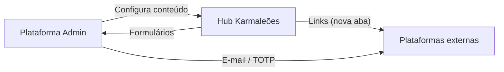
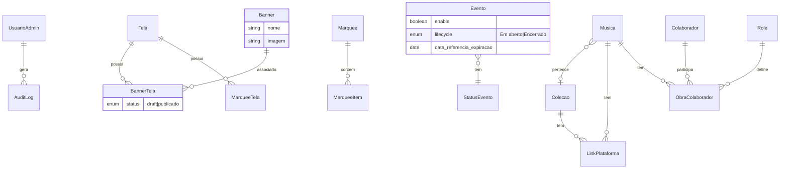

# Design — Plataforma Administrativa Karmaleões

**Data:** 2026-05-25  
**Status:** Aprovado  
**Fonte:** `karmaleoes-admin-functional-specs/` (revisão consolidada)

## 1. Objetivo

Centralizar a gestão operacional do ecossistema Karmaleões em uma plataforma administrativa que configura o **Hub público** — telas, navegação, banners, eventos, conteúdos digitais e obras.

### Escopo do MVP

| Incluído | Excluído |
|----------|----------|
| Auth admin (e-mail + senha + 2FA TOTP) | Níveis de permissão / RBAC |
| CRUD dos módulos 2–6 | Hospedagem de mídia no Hub |
| Auditoria de escritas administrativas | Agendamento/versionamento de banners |
| Links externos (nova aba) | Auto-registro de admin |

### Referência modular

Especificações detalhadas (RF, RN, testes) permanecem em `karmaleoes-admin-functional-specs/modules/`. Este documento consolida decisões de design e inconsistências resolvidas.

---

## 2. Arquitetura funcional

### 2.1 Superfícies



| Superfície | Papel |
|------------|-------|
| **Admin** | Autenticação, CRUD, configuração, visualização de dados recebidos |
| **Hub** | Consumo público, formulários de captação |
| **Externo** | Ticketing, streaming, conteúdo, e-mail (TOTP via app) |

### 2.2 Origem dos dados

| Entidade | Origem | Admin |
|----------|--------|-------|
| Telas, marquees, banners, eventos, conteúdos, obras | Cadastro manual | CRUD |

### 2.3 Dependências entre módulos

```
Autenticação (1) → protege módulos 2–6
Telas (2) → Banners (3), Marquees (2)
Conteúdos (5) ⊥ Obras (6)
```

---

## 3. Padrões transversais

### 3.1 Autenticação

- Login: e-mail + senha + TOTP (após configuração inicial).
- Sessão única por usuário; expiração por inatividade (timeout definido pelo dev).
- Recuperação de senha **por e-mail** (Supabase Auth nativo). Sem SMS.
- Primeiro admin: seed/migration na implantação (RN-LOGIN-006).
- Sem perfis de acesso no MVP — acesso integral para todos os usuários autenticados.

### 3.2 Auditoria (RF-LOGIN-006)

Toda operação de **escrita** (create, update, delete) gera log:

- Módulo 1: gestão de usuários
- Módulos 2–6: entidades configuráveis

Campos: usuário, data/hora, ação, entidade, ID do registro. Leituras não auditadas no MVP.

### 3.3 Visibilidade no Hub

Cada módulo usa mecanismo próprio — não há flag global de publicação.

| Módulo | Mecanismo | Oculto quando |
|--------|-----------|---------------|
| Telas | habilitada / desabilitada | desabilitada |
| Banners | status da associação Banner×Tela | draft ou tela desabilitada |
| Eventos | `enable_efetivo` (enable armazenado e não expirado) | enable false **ou** expirado |
| Conteúdos | draft / pendente / publicado / desabilitado | ≠ publicado |
| Obras | — | sempre visível (MVP) |

### 3.4 Links e mídia

- Links externos sempre abrem em **nova aba**.
- Hub não hospeda mídia (vídeo/áudio/streaming) — apenas metadados + URLs.
- Imagens admin (banner, thumbnail, capa): upload na plataforma admin via **Supabase Storage** (S3-compatível, mesmo projeto/Auth/RLS, CDN e transformação de imagem inclusos). S3/Cloudflare R2 ficam como saída futura, viável pela compatibilidade S3. Formatos/limites a definir pelo dev.

### 3.5 Glossário resumido

| Termo | Significado |
|-------|-------------|
| Enable | Visibilidade de evento no Hub (independe de lifecycle/status) |
| LifeCycle | Evento: Em aberto / Encerrado |
| Data de referência para expiração | `data` ou `nova data` (se Adiado) |
| Asset | Recurso sem status de publicação (ex.: banner) |

---

## 4. Módulos — decisões de design

### 4.1 Autenticação (Módulo 1)

**Entidade: Usuário Administrativo**

| Campo | Regra |
|-------|-------|
| E-mail | Obrigatório, único, imutável — identificador de login |
| Telefone | Opcional (contato) — recuperação é por e-mail |
| Senha | Temporária no cadastro |
| Status | ativo / inativo |
| 2FA configurado | false até primeiro acesso |

**Fluxos principais**

1. Admin cadastra usuário (e-mail + senha temp.; telefone opcional)
2. Primeiro login → QR TOTP → validação → 2FA ativo
3. Logins seguintes → e-mail + senha + TOTP
4. Recuperação → e-mail → link/código por e-mail → nova senha

---

### 4.2 Telas, Navegação e Marquees (Módulo 2)

- Telas representam rotas existentes no código do Hub — cadastro manual, não dinâmico.
- Marquees: entidade independente, reutilizável (N:N com telas).
- Itens de marquee: um destino por vez (interno ou externo).
- Navegação interna bloqueada para telas desabilitadas.

---

### 4.3 Banners (Módulo 3) — decisão revisada

**Problema resolvido:** status global no banner conflitava com regra "um ativo por tela" em associações multi-tela.

**Modelo adotado: status na associação Banner × Tela**

| Entidade | Responsabilidade |
|----------|------------------|
| **Banner** | Asset: nome + imagem (sem status) |
| **Associação Banner×Tela** | status draft/publicado por tela |

**Regras**

- Publicação independente por tela.
- Ao publicar na tela X, associação anterior **da mesma tela** → draft; outras telas inalteradas.
- Banner não exibido em telas desabilitadas (RN-BANNER-007).
- Associação só em telas habilitadas (RN-BANNER-008).

---

### 4.4 Eventos (Módulo 4) — decisão revisada

**Três eixos independentes**

| Eixo | Valores | Controle |
|------|---------|----------|
| LifeCycle | Em aberto, Encerrado | Admin (encerramento) |
| Status (armazenado) | Por lifecycle | Admin |
| Enable (armazenado) | true/false | Admin |

**Expiração por campo virtual** (sem job — calculada na leitura, dia seguinte à data de referência). Nenhum dado armazenado é mutado:

| Situação | LifeCycle | `status_efetivo` | `enable_efetivo` |
|----------|-----------|------------------|------------------|
| Em aberto | Em aberto | "Expirado" | false |
| Encerrado (Cancelado ou Sucesso) | inalterado | status armazenado | false |

- `expirado` = data atual passou da data de referência. `enable_efetivo` = `enable` armazenado **E NÃO** `expirado` (rege a visibilidade no Hub). "Expirado" é rótulo virtual, não status armazenado.
- Por ser reativo, mudar a data de referência (ex.: Adiado + nova data futura) faz o evento deixar de ser expirado automaticamente.

**Encerramento manual**

| Status | Quando permitido | Enable |
|--------|------------------|--------|
| Cancelado | A qualquer momento (incl. antes da data) | inalterado |
| Sucesso | Na data de referência ou depois | inalterado |

- Encerramento **nunca** altera Enable; admin pode setar Enable=false manualmente.
- Cancelado antecipado: visível (`enable_efetivo`=true) até a data de referência ocultar via cálculo virtual.
- Sucesso antes da data de referência: **bloqueado** (RN-EVENTO-014).
- Status protegido (definição): Adiado — não editável/excluível. "Expirado" é rótulo virtual reservado (não armazenado, não cadastrável).
- Status em uso: não excluíveis (RN-EVENTO-013).

**Data de referência:** `data` padrão; `nova data` se status Adiado.

---

### 4.5 Conteúdos Digitais (Módulo 5)

- Tipos fixos (enum): vídeo, playlist, notícia, entrevista, podcast.
- Categorias temáticas gerenciáveis pelo admin (CRUD na implementação).
- Status: draft (rascunho), pendente (revisão), publicado (visível), desabilitado (retirado).
- Destaque e ordenação manual no Hub.
- Independente do módulo Obras (RN-CONT-008).

---

### 4.6 Obras e Colaborações (Módulo 6)

- Músicas, coleções (álbum/EP), colaboradores, roles dinâmicos.
- Música → no máximo uma coleção (N:1).
- Links de plataforma (Spotify, Deezer, etc.) por música ou coleção.
- Sem controle de status/visibilidade no MVP — visível após cadastro.

---

---

## 5. Modelo conceitual consolidado



---

## 6. Inconsistências resolvidas nesta revisão

| # | Problema | Resolução |
|---|----------|-----------|
| 1 | Banner: status global vs. regra por tela | Status na associação Banner×Tela |
| 2 | Eventos: expiração vs. encerramento confusos | Três eixos; expiração por campo virtual (`enable_efetivo`/`status_efetivo`), sem job |
| 3 | Sucesso antes da data permitido implicitamente | Bloqueado (RN-EVENTO-014) |
| 4 | Cancelado: Enable forçado vs. inalterado | Encerramento não altera Enable |
| 5 | Expiração após Adiado: qual data? | Data de referência = nova data |
| 6 | Auth: canal de recuperação de senha | Recuperação por e-mail (Supabase Auth); sem SMS; telefone opcional |
| 7 | Auditoria: escopo indefinido | Escrita nos módulos 1–6 |
| 8 | Protegido: só Expirado na descrição | Expirado e Adiado |

---

## 7. Fora de escopo / adiado para implementação

- CRUD de categorias de conteúdo (detalhar na implementação)
- Validação de formato telefone/e-mail
- Fuso horário / data corrente usados no cálculo de expiração (campo virtual)
- Timeout de sessão por inatividade
- Upload: formatos, tamanhos, storage backend
- Reset de 2FA pelo admin
- Direitos LGPD (portabilidade, exclusão)

---

## 8. Critérios de aceite transversais

- [ ] Admin exige auth em todas as rotas protegidas
- [ ] Escritas administrativas geram audit log
- [ ] Links externos abrem em nova aba no Hub
- [ ] Hub não hospeda mídia streaming
- [ ] Visibilidade respeita mecanismo por módulo (tabela §3.3)
- [ ] Roteiros de teste em `karmaleoes-admin-functional-specs/modules/*/TESTES.md` passam

---

## 9. Próximo passo

Gerar plano de implementação em `docs/superpowers/plans/` via skill **writing-plans**, priorizando:

1. Autenticação + bootstrap
2. Telas + marquees
3. Banners (modelo associação)
4. Eventos (lifecycle + expiração por campo virtual)
5. Conteúdos + obras
