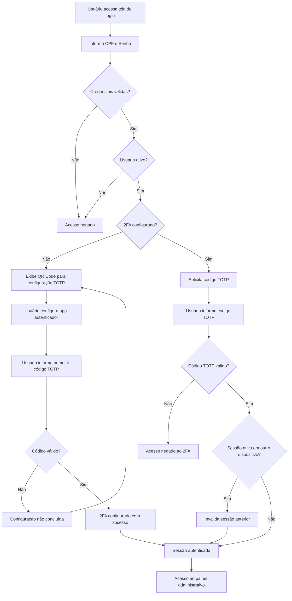
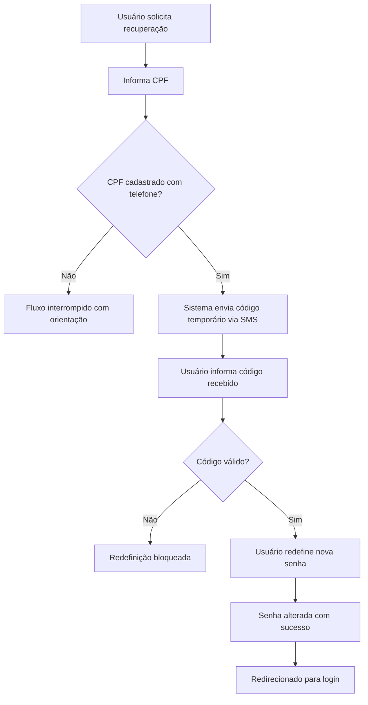
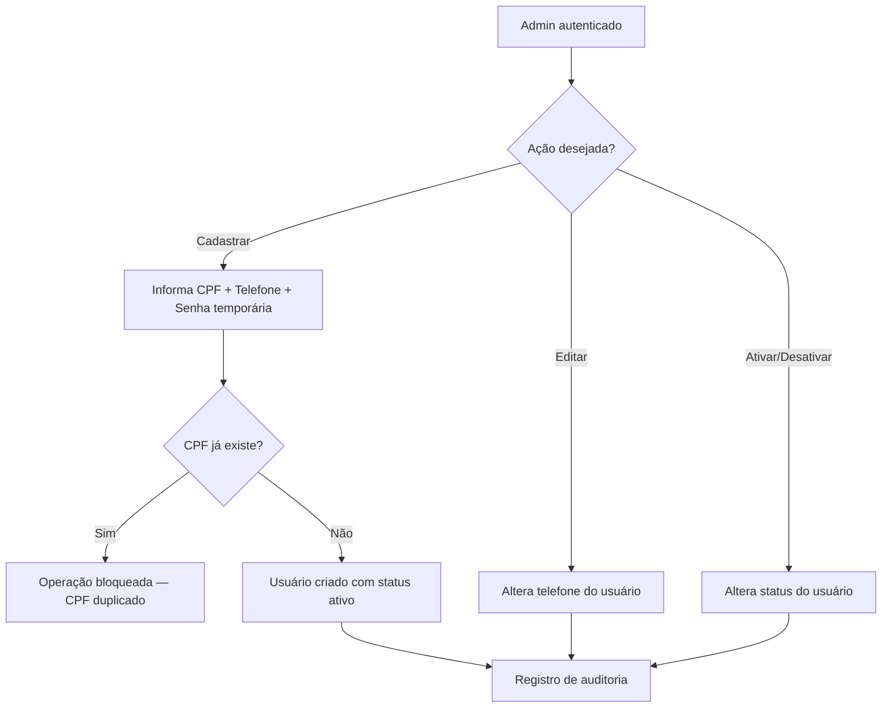
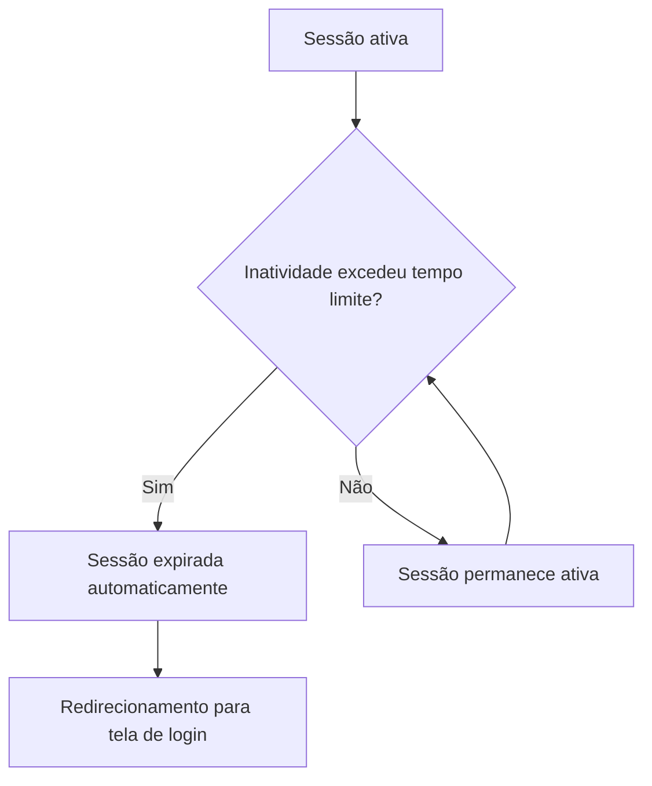

# Fluxograma — Autenticação, Login e Controle de Sessão

## Fluxo de Login (CPF + Senha + 2FA)

```mermaid
flowchart TD
    A[Usuário acessa tela de login] --> B[Informa CPF e Senha]
    B --> C{Credenciais válidas?}
    C -- Não --> D[Acesso negado]
    C -- Sim --> E{Usuário ativo?}
    E -- Não --> D
    E -- Sim --> F{2FA configurado?}
    F -- Não --> G[Exibe QR Code para configuração TOTP]
    G --> H[Usuário configura app autenticador]
    H --> I[Usuário informa primeiro código TOTP]
    I --> J{Código válido?}
    J -- Não --> K[Configuração não concluída]
    K --> G
    J -- Sim --> L[2FA configurado com sucesso]
    L --> M[Sessão autenticada]
    F -- Sim --> N[Solicita código TOTP]
    N --> O[Usuário informa código TOTP]
    O --> P{Código TOTP válido?}
    P -- Não --> Q[Acesso negado ao 2FA]
    P -- Sim --> R{Sessão ativa em outro dispositivo?}
    R -- Sim --> S[Invalida sessão anterior]
    S --> M
    R -- Não --> M
    M --> T[Acesso ao painel administrativo]
```

## Fluxo de Recuperação de Senha

```mermaid
flowchart TD
    A[Usuário solicita recuperação] --> B[Informa CPF]
    B --> C{CPF cadastrado com telefone?}
    C -- Não --> D[Fluxo interrompido com orientação]
    C -- Sim --> E[Sistema envia código temporário via SMS]
    E --> F[Usuário informa código recebido]
    F --> G{Código válido?}
    G -- Não --> H[Redefinição bloqueada]
    G -- Sim --> I[Usuário redefine nova senha]
    I --> J[Senha alterada com sucesso]
    J --> K[Redirecionado para login]
```

## Fluxo de Gestão de Usuários

```mermaid
flowchart TD
    A[Admin autenticado] --> B{Ação desejada?}
    B -- Cadastrar --> C[Informa CPF + Telefone + Senha temporária]
    C --> D{CPF já existe?}
    D -- Sim --> E[Operação bloqueada — CPF duplicado]
    D -- Não --> F[Usuário criado com status ativo]
    F --> G[Registro de auditoria]
    B -- Editar --> H[Altera telefone do usuário]
    H --> G
    B -- Ativar/Desativar --> I[Altera status do usuário]
    I --> G
```

## Fluxo de Sessão e Expiração

```mermaid
flowchart TD
    A[Sessão ativa] --> B{Inatividade excedeu tempo limite?}
    B -- Sim --> C[Sessão expirada automaticamente]
    C --> D[Redirecionamento para tela de login]
    B -- Não --> E[Sessão permanece ativa]
    E --> B
```
