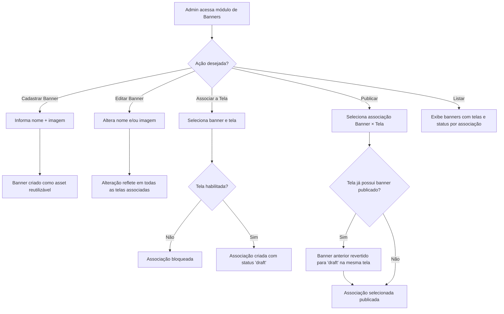
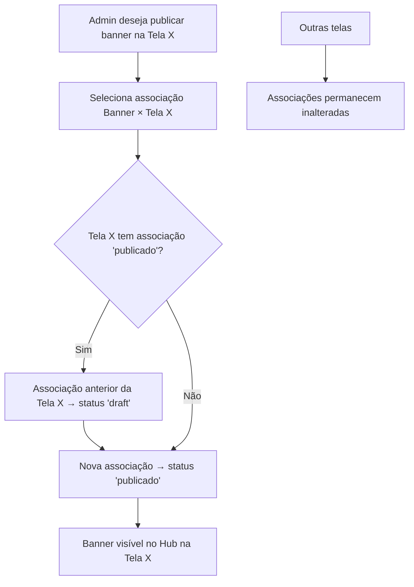
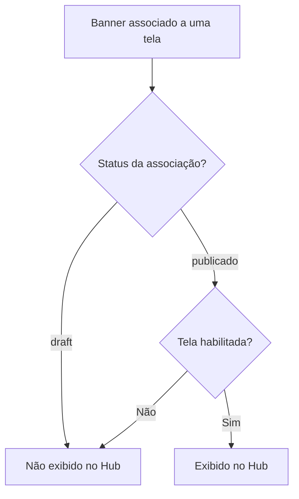

# Fluxograma — Gestão de Banners por Tela

## Fluxo Principal

```mermaid
flowchart TD
    A[Admin acessa módulo de Banners] --> B{Ação desejada?}
    B -- Cadastrar Banner --> C[Informa nome + imagem]
    C --> D[Banner criado como asset reutilizável]
    B -- Editar Banner --> E[Altera nome e/ou imagem]
    E --> F[Alteração reflete em todas as telas associadas]
    B -- Associar a Tela --> G[Seleciona banner e tela]
    G --> H{Tela habilitada?}
    H -- Não --> I[Associação bloqueada]
    H -- Sim --> J[Associação criada com status 'draft']
    B -- Publicar --> K[Seleciona associação Banner × Tela]
    K --> L{Tela já possui banner publicado?}
    L -- Sim --> M[Banner anterior revertido para 'draft' na mesma tela]
    M --> N[Associação selecionada publicada]
    L -- Não --> N
    B -- Listar --> O[Exibe banners com telas e status por associação]
```

## Fluxo de Publicação e Controle de Ativo

```mermaid
flowchart TD
    A[Admin deseja publicar banner na Tela X] --> B[Seleciona associação Banner × Tela X]
    B --> C{Tela X tem associação 'publicado'?}
    C -- Sim --> D[Associação anterior da Tela X → status 'draft']
    D --> E[Nova associação → status 'publicado']
    C -- Não --> E
    E --> F[Banner visível no Hub na Tela X]

    G[Outras telas] --> H[Associações permanecem inalteradas]
```

## Regras de Visibilidade no Hub

```mermaid
flowchart TD
    A[Banner associado a uma tela] --> B{Status da associação?}
    B -- draft --> C[Não exibido no Hub]
    B -- publicado --> D{Tela habilitada?}
    D -- Não --> C
    D -- Sim --> E[Exibido no Hub]
```
