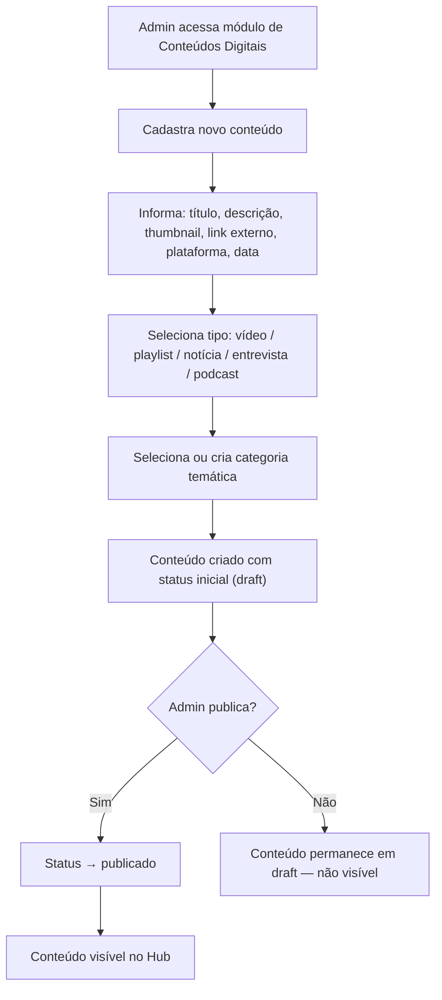
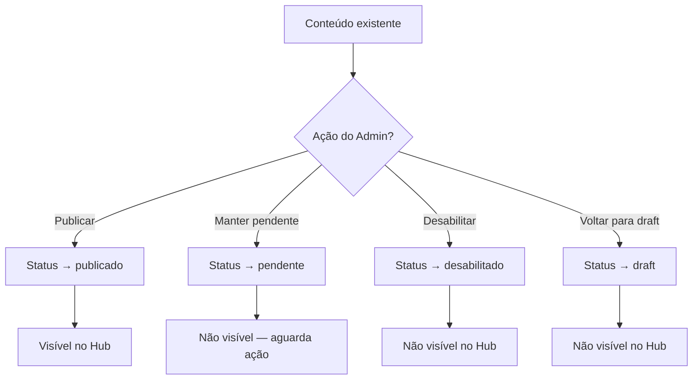
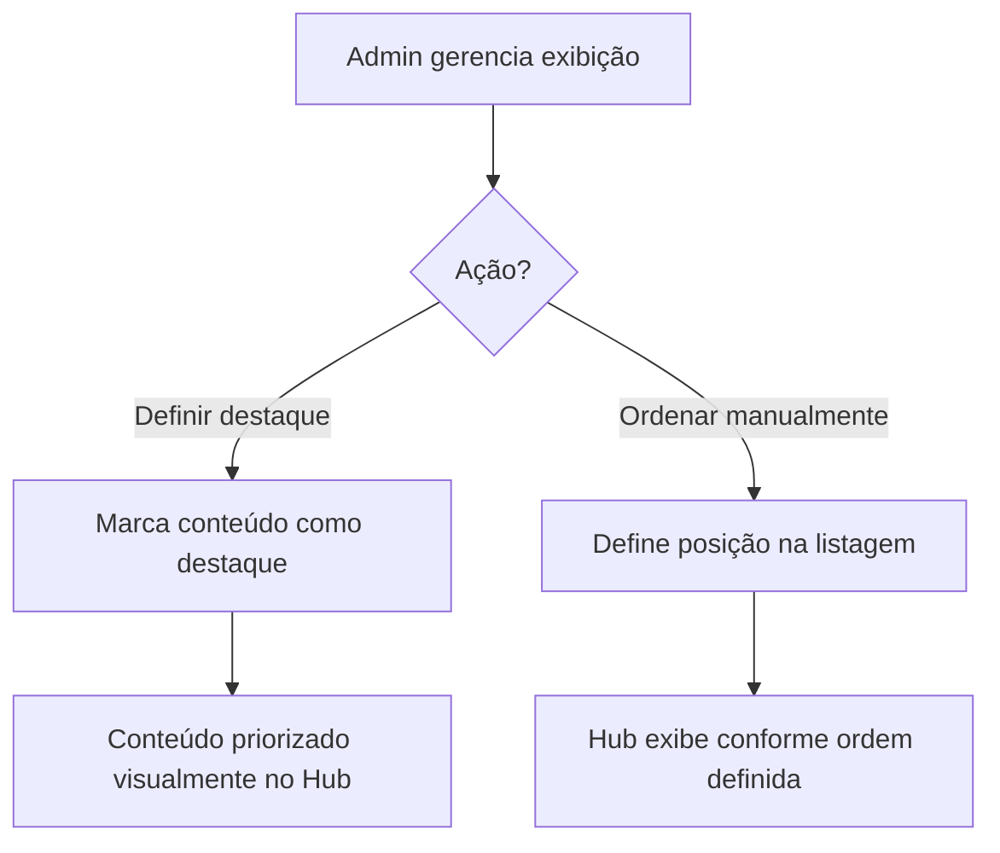
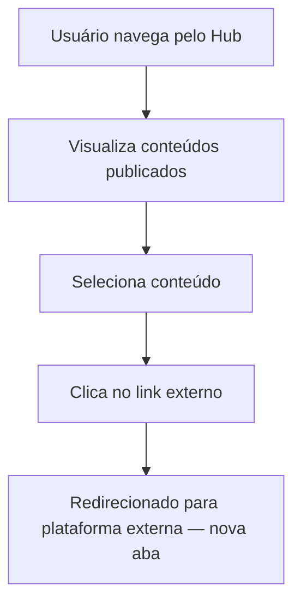
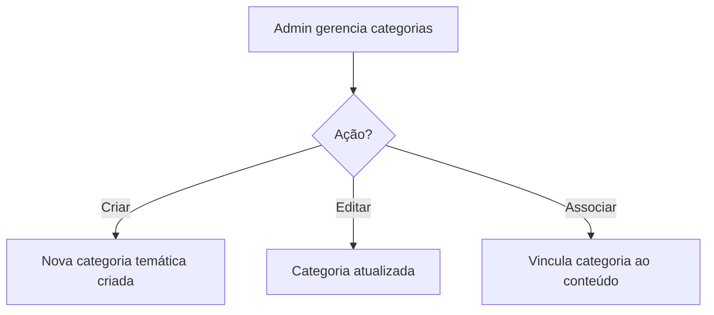
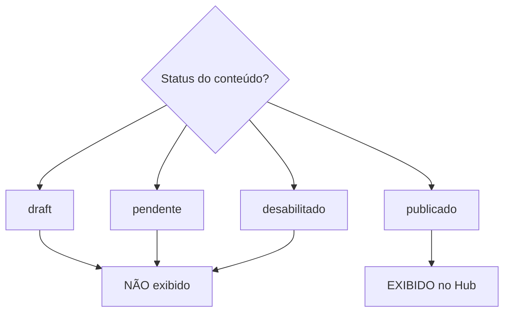

# Fluxograma — Gestão de Conteúdos Digitais

## Fluxo Principal (Cadastro à Publicação)

## Fluxo de Controle de Status

## Fluxo de Destaque e Ordenação

## Fluxo do Usuário no Hub

## Gestão de Categorias

## Visibilidade no Hub

