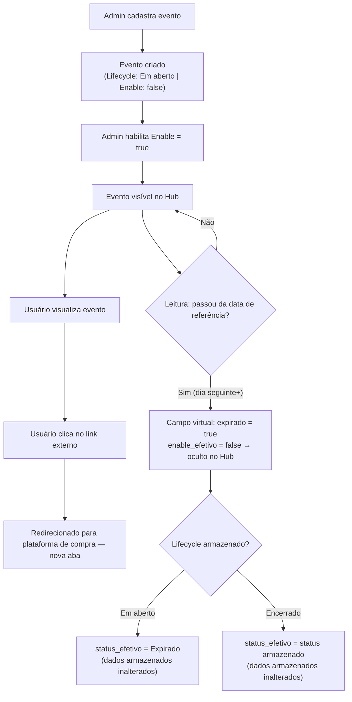
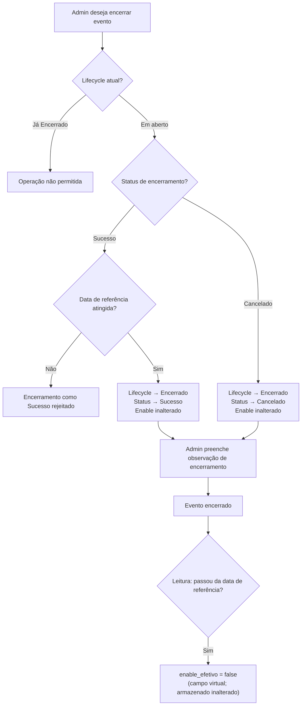
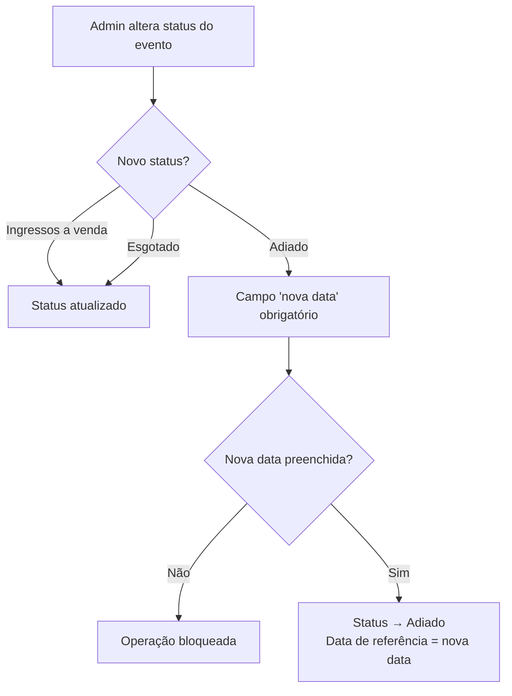
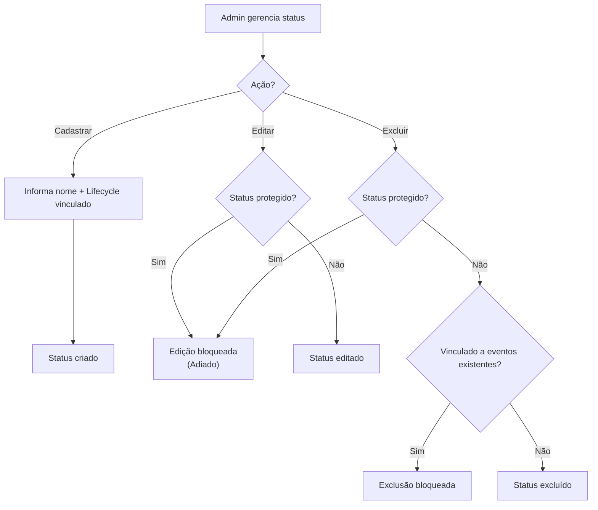
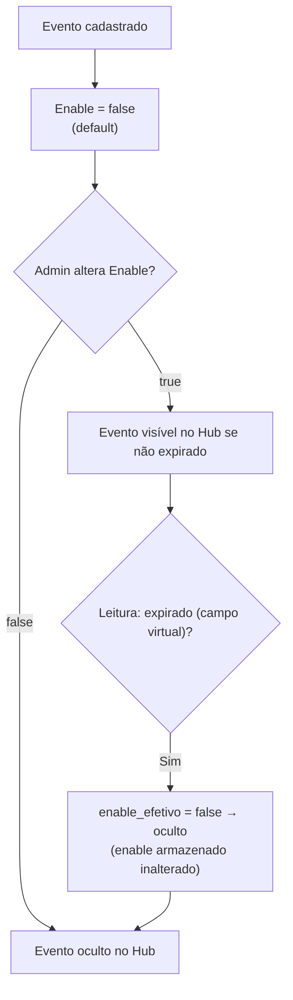

# Fluxograma — Gestão de Eventos

## Fluxo Principal (Lifecycle Completo)

## Fluxo de Encerramento Manual

## Fluxo de Alteração de Status (Lifecycle Em Aberto)

## Fluxo de Gestão de Status (CRUD)

## Controle de Visibilidade (Enable)

