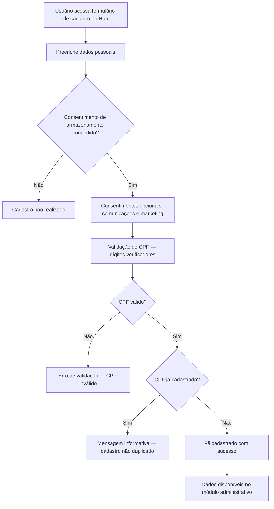
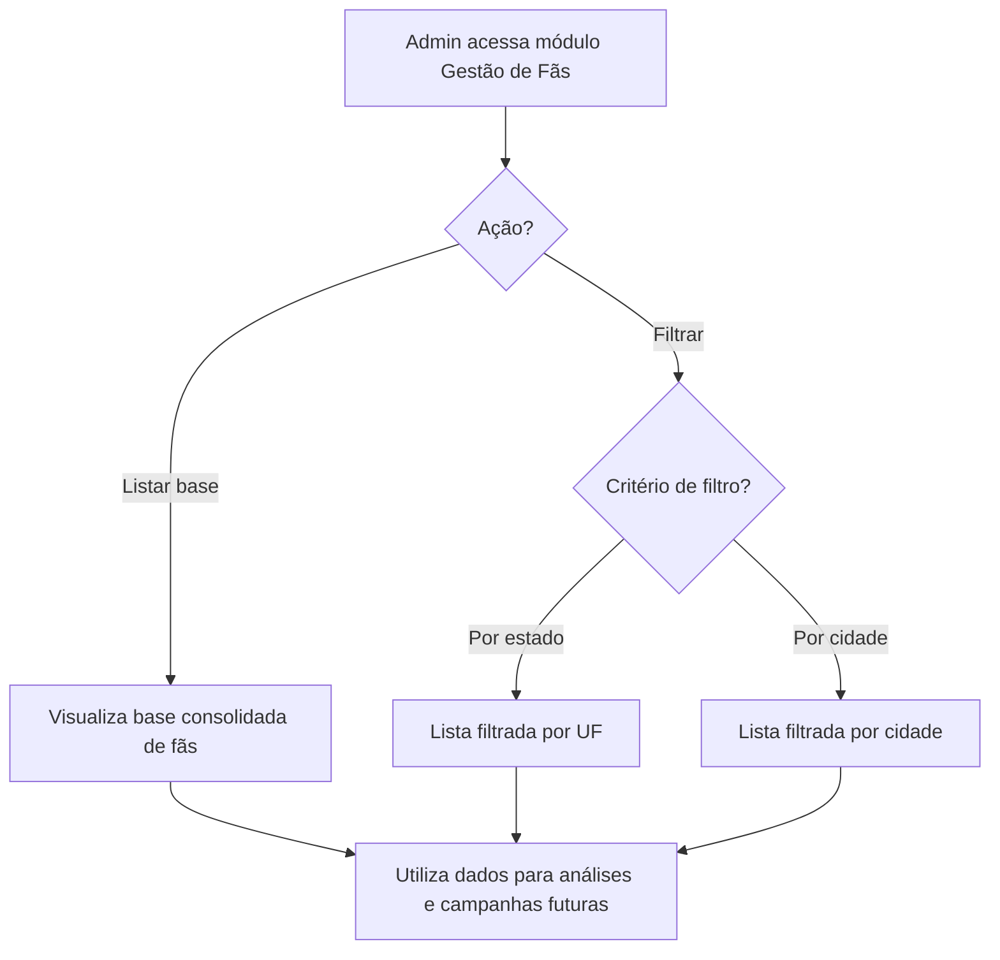
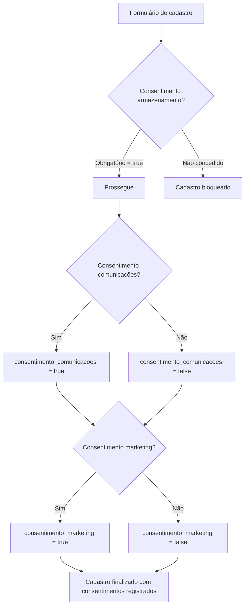
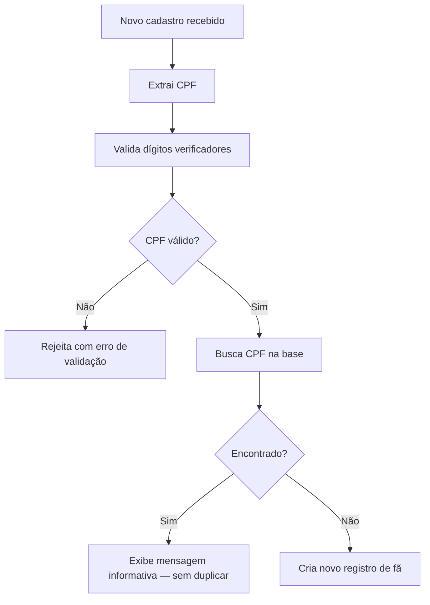

# Fluxograma — Gestão de Fãs (CRM Inicial)

## Fluxo Principal (Cadastro de Fã via Hub)

```mermaid
flowchart TD
    A[Usuário acessa formulário de cadastro no Hub] --> B[Preenche dados pessoais]
    B --> C{Consentimento de armazenamento concedido?}
    C -- Não --> D[Cadastro não realizado]
    C -- Sim --> E[Consentimentos opcionais: comunicações e marketing]
    E --> F[Validação de CPF — dígitos verificadores]
    F --> G{CPF válido?}
    G -- Não --> H[Erro de validação — CPF inválido]
    G -- Sim --> I{CPF já cadastrado?}
    I -- Sim --> J[Mensagem informativa — cadastro não duplicado]
    I -- Não --> K[Fã cadastrado com sucesso]
    K --> L[Dados disponíveis no módulo administrativo]
```

## Fluxo do Administrador

```mermaid
flowchart TD
    A[Admin acessa módulo Gestão de Fãs] --> B{Ação?}
    B -- Listar base --> C[Visualiza base consolidada de fãs]
    B -- Filtrar --> D{Critério de filtro?}
    D -- Por estado --> E[Lista filtrada por UF]
    D -- Por cidade --> F[Lista filtrada por cidade]
    C --> G[Utiliza dados para análises e campanhas futuras]
    E --> G
    F --> G
```

## Fluxo de Consentimentos

```mermaid
flowchart TD
    A[Formulário de cadastro] --> B{Consentimento armazenamento?}
    B -- Obrigatório = true --> C[Prossegue]
    B -- Não concedido --> D[Cadastro bloqueado]
    C --> E{Consentimento comunicações?}
    E -- Sim --> F["consentimento_comunicacoes = true"]
    E -- Não --> G["consentimento_comunicacoes = false"]
    F --> H{Consentimento marketing?}
    G --> H
    H -- Sim --> I["consentimento_marketing = true"]
    H -- Não --> J["consentimento_marketing = false"]
    I --> K[Cadastro finalizado com consentimentos registrados]
    J --> K
```

## Regra de Deduplicação

```mermaid
flowchart TD
    A[Novo cadastro recebido] --> B[Extrai CPF]
    B --> C[Valida dígitos verificadores]
    C --> D{CPF válido?}
    D -- Não --> E[Rejeita com erro de validação]
    D -- Sim --> F[Busca CPF na base]
    F --> G{Encontrado?}
    G -- Sim --> H[Exibe mensagem informativa — sem duplicar]
    G -- Não --> I[Cria novo registro de fã]
```
