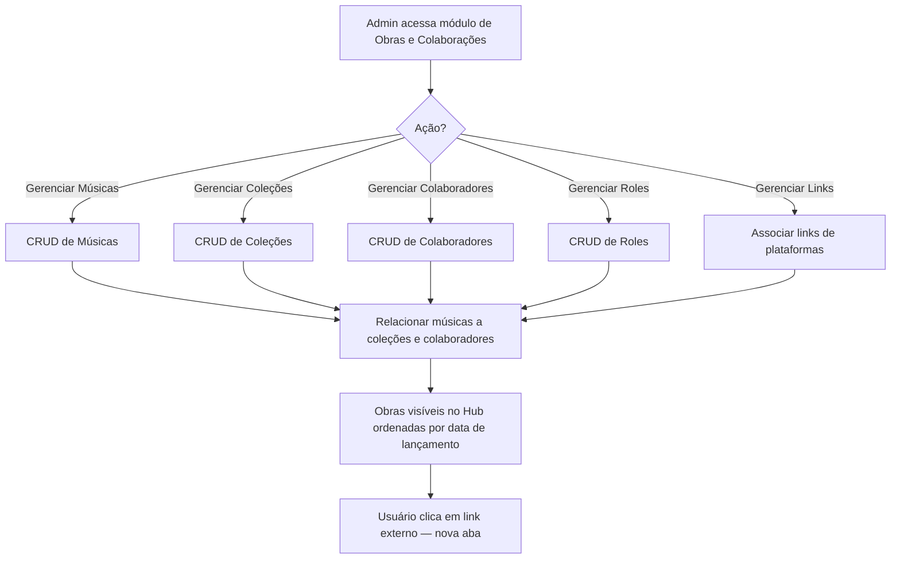
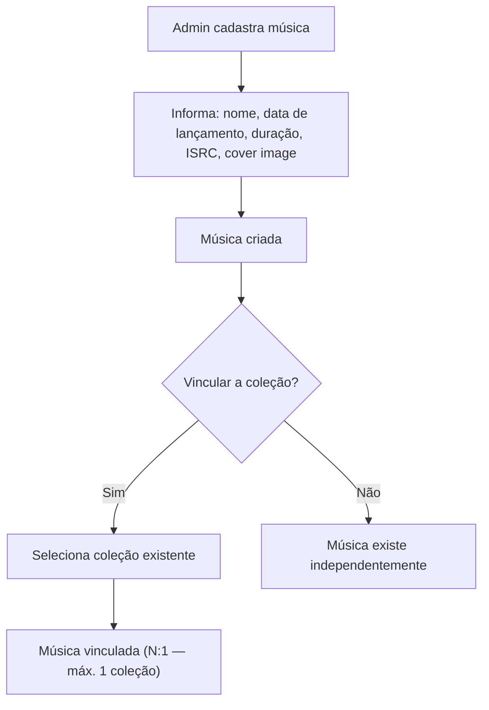
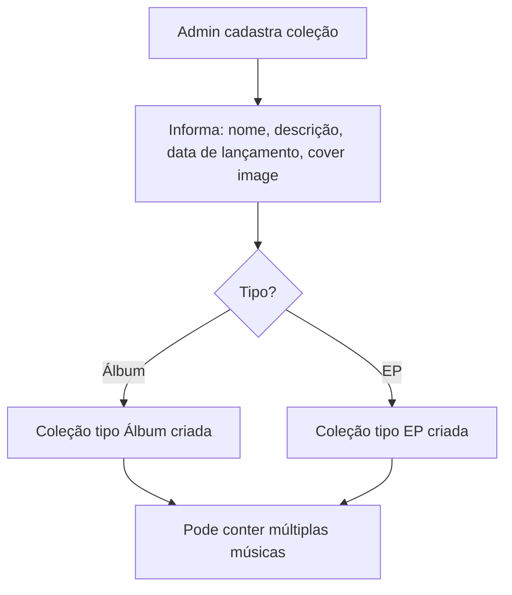
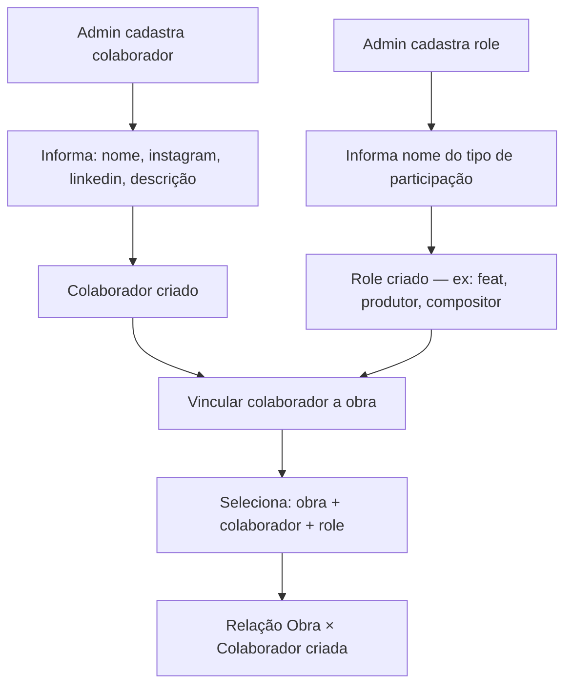
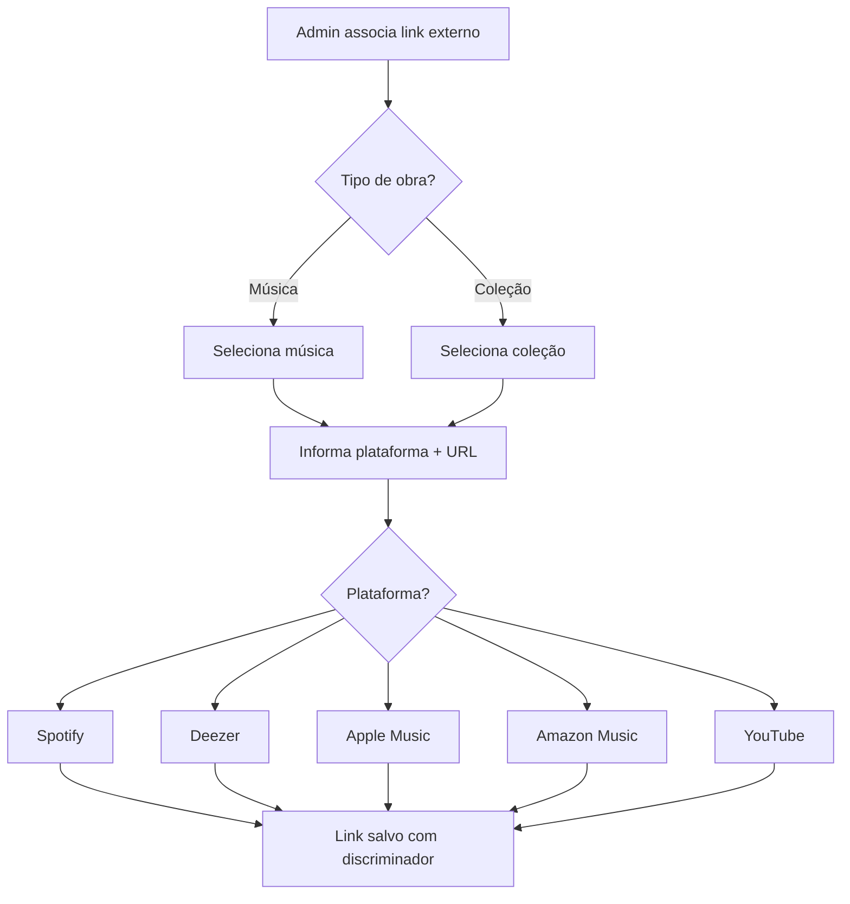
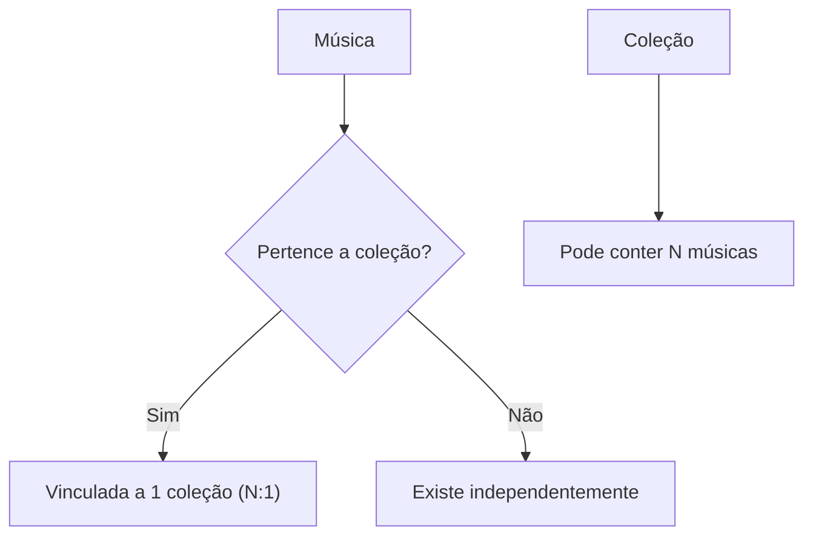

# Fluxograma — Gestão de Obras e Colaborações

## Fluxo Principal (Visão Geral)

## Fluxo de Cadastro de Música

## Fluxo de Cadastro de Coleção

## Fluxo de Colaboradores e Roles

## Fluxo de Links de Plataformas

## Relacionamento Música × Coleção

