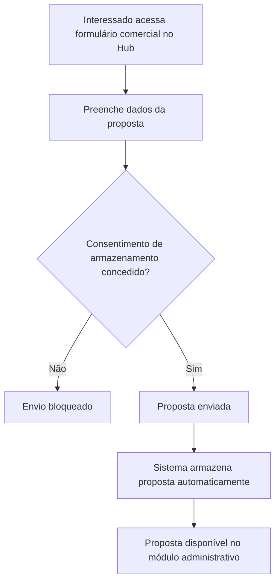
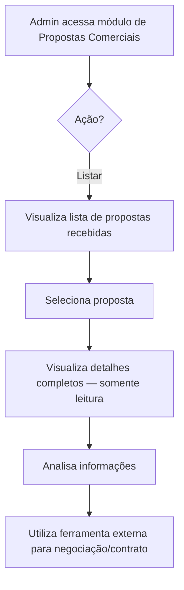
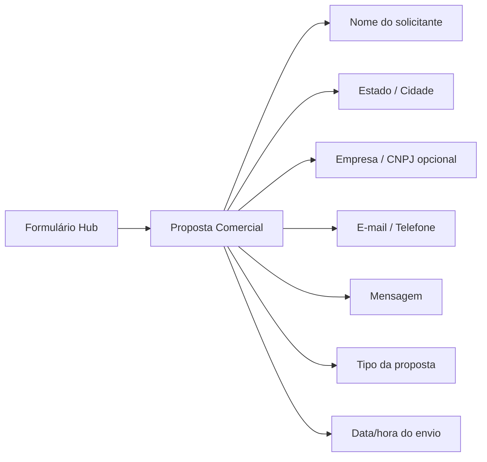
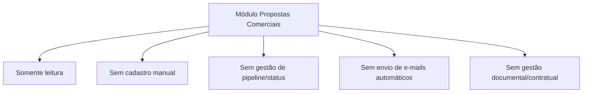

# Fluxograma — Gestão de Propostas Comerciais

## Fluxo Principal (Recebimento e Visualização)

```mermaid
flowchart TD
    A[Interessado acessa formulário comercial no Hub] --> B[Preenche dados da proposta]
    B --> C{Consentimento de armazenamento concedido?}
    C -- Não --> D[Envio bloqueado]
    C -- Sim --> E[Proposta enviada]
    E --> F[Sistema armazena proposta automaticamente]
    F --> G[Proposta disponível no módulo administrativo]
```

## Fluxo do Administrador

```mermaid
flowchart TD
    A[Admin acessa módulo de Propostas Comerciais] --> B{Ação?}
    B -- Listar --> C[Visualiza lista de propostas recebidas]
    C --> D[Seleciona proposta]
    D --> E[Visualiza detalhes completos — somente leitura]
    E --> F[Analisa informações]
    F --> G[Utiliza ferramenta externa para negociação/contrato]
```

## Estrutura dos Dados Recebidos

```mermaid
flowchart LR
    A[Formulário Hub] --> B[Proposta Comercial]
    B --> C[Nome do solicitante]
    B --> D[Estado / Cidade]
    B --> E[Empresa / CNPJ opcional]
    B --> F[E-mail / Telefone]
    B --> G[Mensagem]
    B --> H[Tipo da proposta]
    B --> I[Data/hora do envio]
```

## Escopo do Módulo (O que NÃO faz)

```mermaid
flowchart TD
    A[Módulo Propostas Comerciais] --> B[Somente leitura]
    A --> C[Sem cadastro manual]
    A --> D[Sem gestão de pipeline/status]
    A --> E[Sem envio de e-mails automáticos]
    A --> F[Sem gestão documental/contratual]
```
