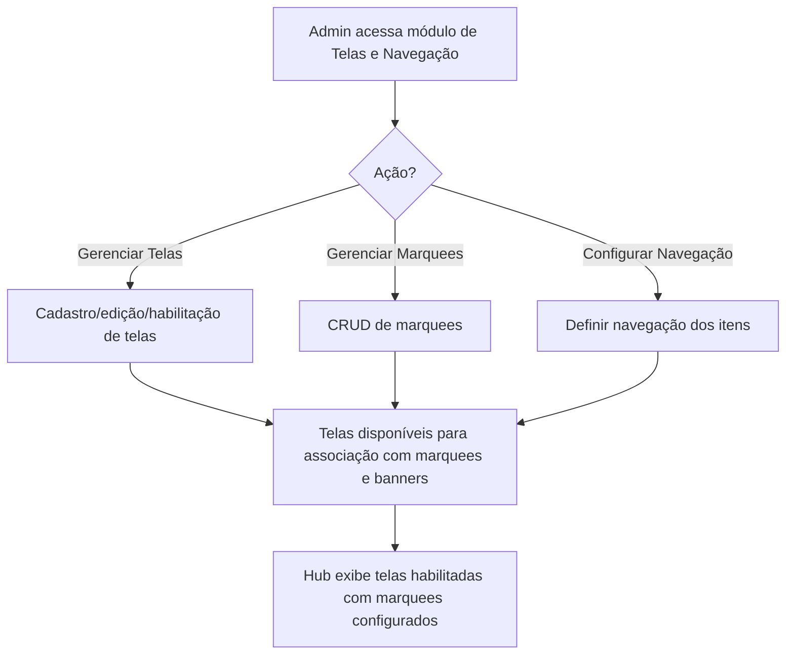
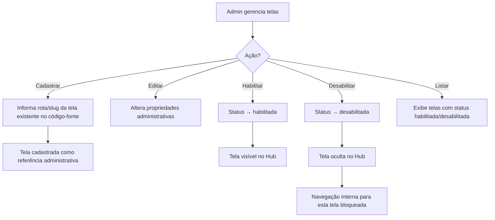
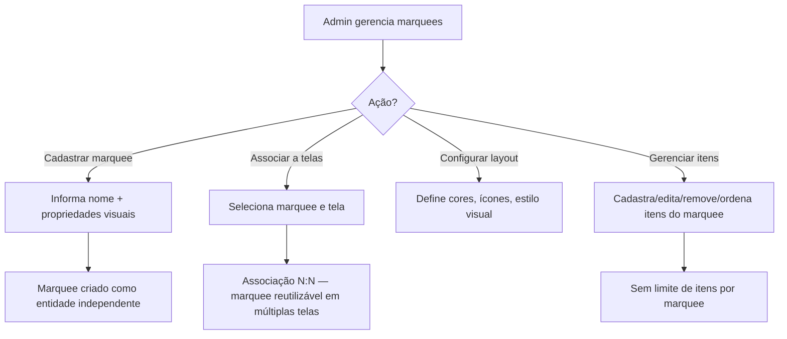
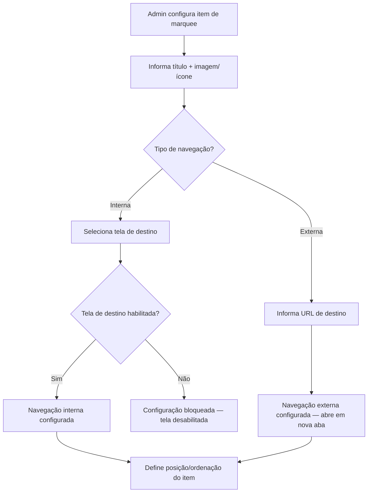
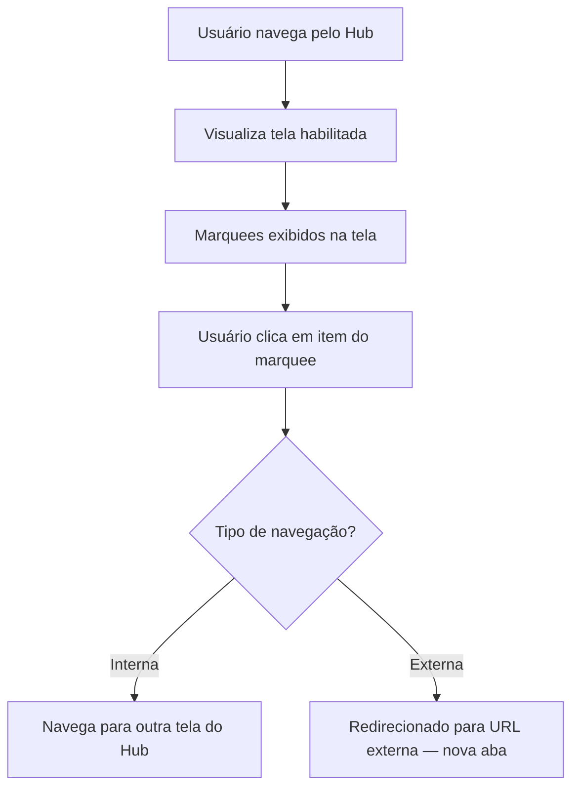
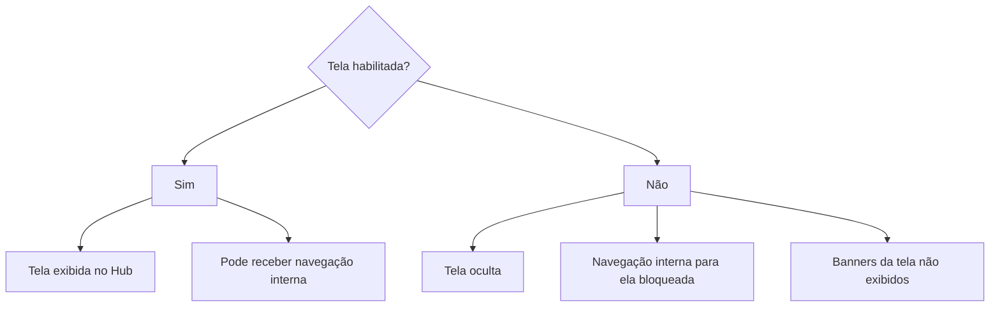

# Fluxograma — Gestão de Telas, Navegação Interna e Marquees

## Fluxo Principal (Visão Geral)

## Fluxo de Gestão de Telas

## Fluxo de Gestão de Marquees

## Fluxo de Configuração de Itens do Marquee

## Fluxo do Usuário no Hub

## Regras de Visibilidade

